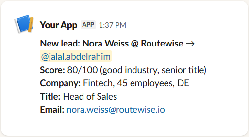
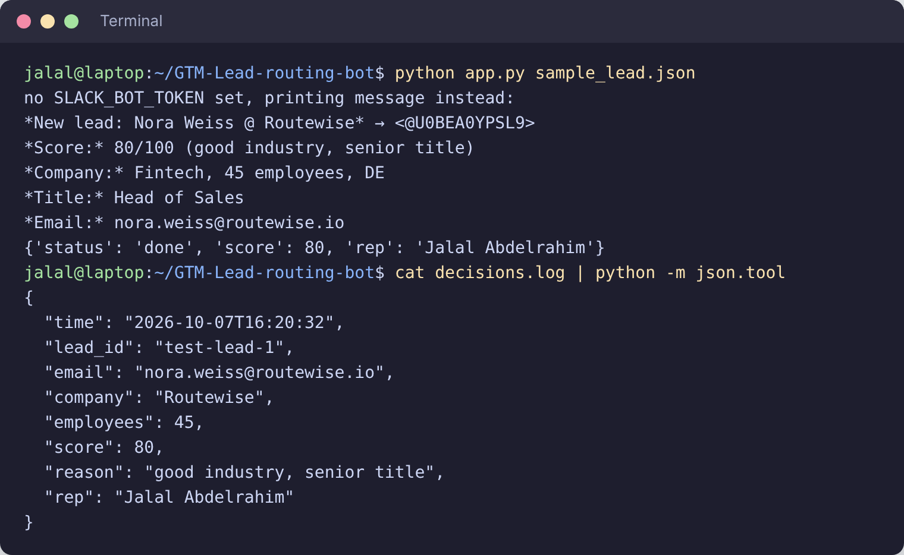
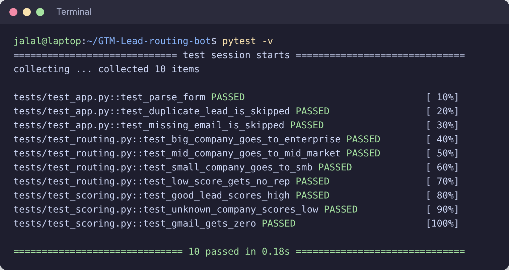

# GTM Lead Routing Bot

A small Flask app that takes new leads from a HubSpot form, scores them, and posts them in Slack tagged to the right sales rep.

## Screenshots

The Slack message a rep gets (the rep is @mentioned):



Running the sample lead with no API keys set, and the decision that got logged:



Tests:



## How it works

1. HubSpot sends the form submission to `/webhook`.
2. We look up the company from the email domain (`enrichment.py`).
3. The lead gets a score from 0 to 100 (`scoring.py`):
   - If `ANTHROPIC_API_KEY` is set, Claude scores it against our ideal customer profile (ICP).
   - Otherwise, or if Claude fails, it uses simple rules: industry, company size and job title.
   - Personal emails (gmail etc.) always get 0.
4. We pick a rep based on company size (`routing.py`):
   - 1000+ employees: enterprise rep
   - 200 to 999 employees: mid-market rep
   - Under 200 employees: SMB rep
   - Score under 50: no rep, the lead goes to marketing for nurture
5. We post the lead in Slack and @ the rep (`slack.py`).

The app also:
- Retries Slack and Claude calls up to 3 times if they fail.
- Skips duplicate submissions (HubSpot sometimes sends the same one twice).
- Logs every decision to `decisions.log`.

## Setup

```
pip install -r requirements.txt
cp .env.example .env
```

Fill in `.env`:
- `SLACK_BOT_TOKEN`: from a Slack app with the `chat:write` scope. Invite the bot to your channel.
- `SLACK_CHANNEL`: where leads get posted (default `#leads`).
- `ANTHROPIC_API_KEY`: optional. Without it, the rules-based scoring is used.

Reps and the ICP are set in `config.py`.

## Running it

Test with the sample lead (no HubSpot needed):

```
python app.py sample_lead.json
```

Output:

```
no SLACK_BOT_TOKEN set, printing message instead:
*New lead: Nora Weiss @ Routewise* → <@U0BEA0YPSL9>
*Score:* 80/100 (good industry, senior title)
*Company:* Fintech, 45 employees, DE
*Title:* Head of Sales
*Email:* nora.weiss@routewise.io
{'status': 'done', 'score': 80, 'rep': 'Jalal Abdelrahim'}
```

Run the server:

```
python app.py
```

Then in HubSpot, make a workflow with a "Send a webhook" action pointing to `https://<your-server>/webhook`.

## Tests

```
pytest
```

## TODO

- Use a real enrichment API instead of the fake company data.
- Verify the HubSpot webhook signature.
- Use a database instead of text files for duplicates and logs.
